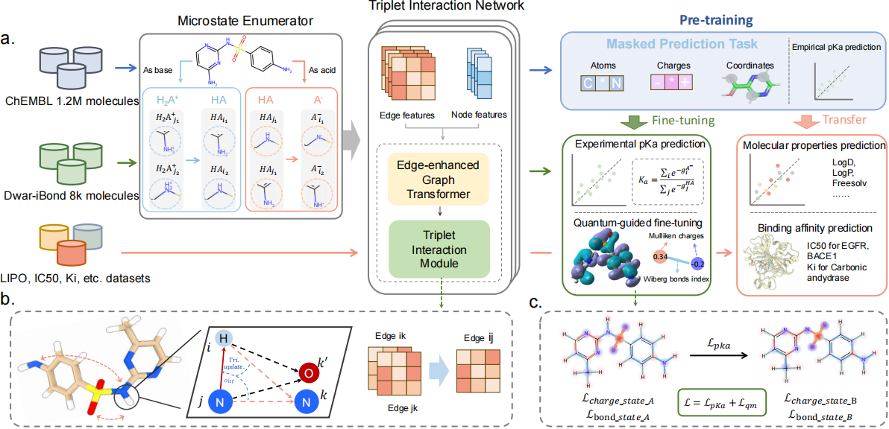

# TripK<sub>a</sub>: Accurate and Scalable Molecular Ionization Property Prediction via Triplet Interaction Networks and Physical Knowledge

<p align='center'>a</sub> architecture.' width='100%'></p>

TripK<sub>a</sub> is an advanced macro- and micro-pK<sub>a</sub> predictor designed to address the challenges of modeling complex atomic interactions and limited high-quality data in molecular discovery. By leveraging a triplet interaction network and integrating quantum-level physical knowledge, TripK<sub>a</sub> effectively captures cooperative and competitive effects in multi-site protonation equilibria. It achieves state-of-the-art performance on the SAMPL6–8 and Novartis datasets. Pretrained on pK<sub>a</sub> data, TripK<sub>a</sub> serves as a robust foundation for molecular property prediction and interaction modeling, providing deeper insights into molecular ionization for downstream applications.

## Installation

To set up the required `conda` environment, follow the instructions in [Uni-Core](https://github.com/dptech-corp/Uni-Core) and refer to its [Installation Documentation](https://github.com/dptech-corp/Uni-Core#installation).

<!-- Additional dependencies are listed below:

```
# Add specific dependencies here, e.g.:
# - Python >= 3.8
# - PyTorch >= 1.10
# - RDKit
# - NumPy
# - Pandas
``` -->

## Datasets

Datasets are available at [Google Drive](https://drive.google.com/drive/folders/1lmo2o7qcpgK121NfV4JkwGEeeSZRf1kA?usp=sharing). Download and unzip all files, then place them in the `./Datasets/pickle` directory.

## Data Preprocessing

To preprocess the data, navigate to the `TripKa` directory and run the `process.py` script with the appropriate arguments:

```bash
cd TripKa
python Datasets/process.py --name <str> --num-conf <int> --mm
```

### Parameters
- `--name`: Specifies the dataset name for preprocessing (e.g., `dwar_small`).
- `--num-conf`: Defines the number of conformers to process (integer, default: 1).
- `--mm`: Enables conformer generation using MMFF optimization (default: `False`).

## Training

### Pre-training
First, download and place `chembl_train.pickle` and `chembl_valid.pickle` in `./Datasets/pickle`. Then preprocess the ChEMBL dataset and run the pretraining script:

```bash
cd TripKa
python Datasets/process.py --name "chembl_train" --num-conf 6 --mm
python Datasets/process.py --name "chembl_valid" --num-conf 6 --mm
bash scripts/pretrain_tripka.sh
```

### Fine-tuning
After pretraining, TripK<sub>a</sub> is ready for fine-tuning.

#### Fine-tuning with pK<sub>a</sub> Data Only
Preprocess the `dwar-iBond` dataset and execute the fine-tuning script:

```bash
python Datasets/process.py --name "dwar_small" --num-conf 6
bash scripts/finetune_tripka.sh
```

#### Fine-tuning with Quantum-Level Knowledge Guidance
After initial fine-tuning on pK<sub>a</sub> data, further fine-tune TripK<sub>a</sub> with quantum-level knowledge guidance. First, download the QM-features data and place it in the appropriate directory (update the path in the script), then run:

```bash
bash scripts/finetune_tripka_qm.sh
```

## Inference

To perform macro- or micro-pK<sub>a</sub> predictions on new or standalone data, ensure the base and QM-guided TripK<sub>a</sub> models are trained. Update the weight paths in `scripts/infer_tripka_base CONDITIONS.sh` and `scripts/infer_tripka_qm.sh`, then use the following commands.

### Macro-pK<sub>a</sub> Prediction
```bash
python infer_pKa.py --smiles "<SMILES_STRING>" --dataset "molecule_name" --iter-num 4 --sampl-num 10 --cuda-idx 0 --mode "A/B"
```

### Micro-pK<sub>a</sub> Prediction
```bash
python infer_pKa.py --micro-a "acid_micro_state_smiles" --micro-b "base_micro_state_smiles" --dataset "molecule_name" --sampl-num 10 --cuda-idx 0
```

#### Parameters
- `--name`: Specifies the dataset name for preprocessing (e.g., `dwar_small`).
- `--num-conf`: Defines the number of conformers to process (integer, default: 1).
- `--mm`: Enables conformer generation using MMFF optimization (default: `False`).

## Testing

### Base Model Testing
Preprocess the test dataset and run inference on the base model. For example, on the `novartis_a` test set:

```bash
for ((i=0; i<10; i++)); do
    python Datasets/process.py --name "novartis_a" --num-conf 1 --i $i
done
bash scripts/infer_tripka_base.sh novartis_a 10 ETKDG 0 8
```

### QM-Guided Model Testing
Run inference for the QM-guided TripK<sub>a</sub> model:

```bash
for ((i=0; i<10; i++)); do
    python Datasets/process.py --name "novartis_a" --num-conf 1 --i $i --mm
done
bash scripts/infer_tripka_qm.sh novartis_a 10 MM 0 8
```

## Acknowledgement

This project builds upon the codebases of `Uni-pKa` and `TGT`. We express our gratitude to the authors for their valuable contributions.